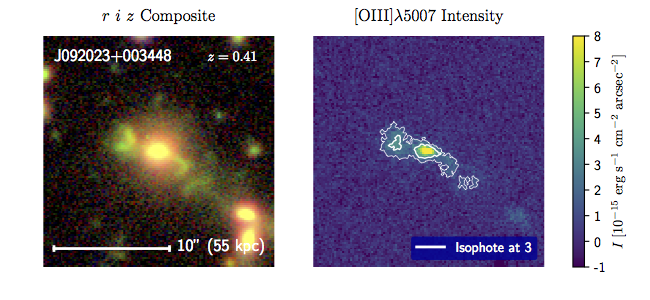

# Bubbleimg

Bubbleimg is a python software for imaging emission-line regions of galaxies with astro images. It handels Sloan Digital Sky Survey (SDSS) and Subaru Hyper Suprime-Cam (HSC) Survey Data. It is also useful for downloading data (catalog, spectrum, and cutout images), measuring spectral line strengths, analysing image on samples of galaxies. For details, see [Sun et al. 2018](https://arxiv.org/abs/1803.07241). 

## Example

The map of the [OIII] extended emission-line region of AGN J092023+003448 constructed from the Subaru Hyper-Suprime Cam images. 

## How to use it

See documentation:

* [Start with one object](docs/obsobj.rst)

* [How to download images](docs/imgdownload.rst)

* [Apply it to the entire sample](docs/batch.rst)

The documentation is not yet complete. 

## Distribution

The current release is vesion 1.0.0. To download code, please go to:

    https://github.com/aileisun/bubbleimg/releases/tag/v1.0.0

You could also clone the most recent version of the repository by: 

    git clone https://github.com/aileisun/bubbleimg.git

To access the downloaded code, one may add the path to the local `~/.bashrc`, 

    export "PYTHONPATH=$PYTHONPATH:/where/you/put/bubbleimg/" 

and don't forget to source it.

    source ~/.bashrc

Then bubbleimg could be imported in Python. 

    import bubbleimg

There are a number of required packages, as listed in [setup.py](setup.py), including a few that needs to be installed manually. Bubbleimg runs under Python 3. 

The code is licensed under the MIT license and is provided "AS IS". Forking the code is welcome. 

## Attribution

Please cite [Sun et al. 2018](https://arxiv.org/abs/1803.07241) if you find this code useful for your research. The BibTex entry for the paper is: 

~~~
@ARTICLE{Sun2018,
   author = {{Sun}, A.-L. and {Greene}, J.~E. and {Zakamska}, N.~L. and {Goulding}, A. and 
    {Strauss}, M.~A. and {Huang}, S. and {Johnson}, S. and {Kawaguchi}, T. and 
    {Matsuoka}, Y. and {Marsteller}, A.~A. and {Nagao}, T. and {Toba}, Y.
    },
    title = "{Imaging Extended Emission-Line Regions of Obscured AGN with the Subaru Hyper Suprime-Cam Survey}",
  journal = {ArXiv e-prints},
archivePrefix = "arXiv",
   eprint = {1803.07241},
 keywords = {Astrophysics - Astrophysics of Galaxies},
     year = 2018,
    month = mar,
   adsurl = {http://adsabs.harvard.edu/abs/2018arXiv180307241S},
  adsnote = {Provided by the SAO/NASA Astrophysics Data System}
}
~~~

